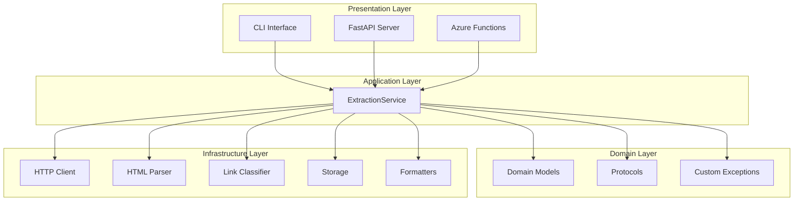
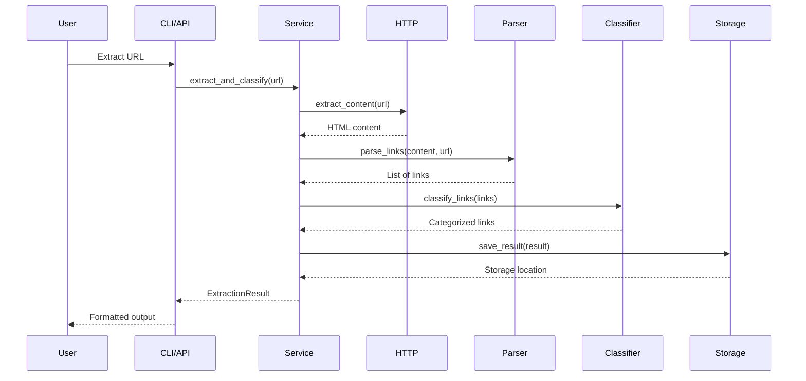
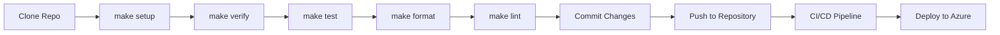
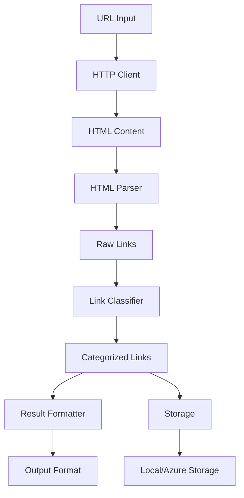
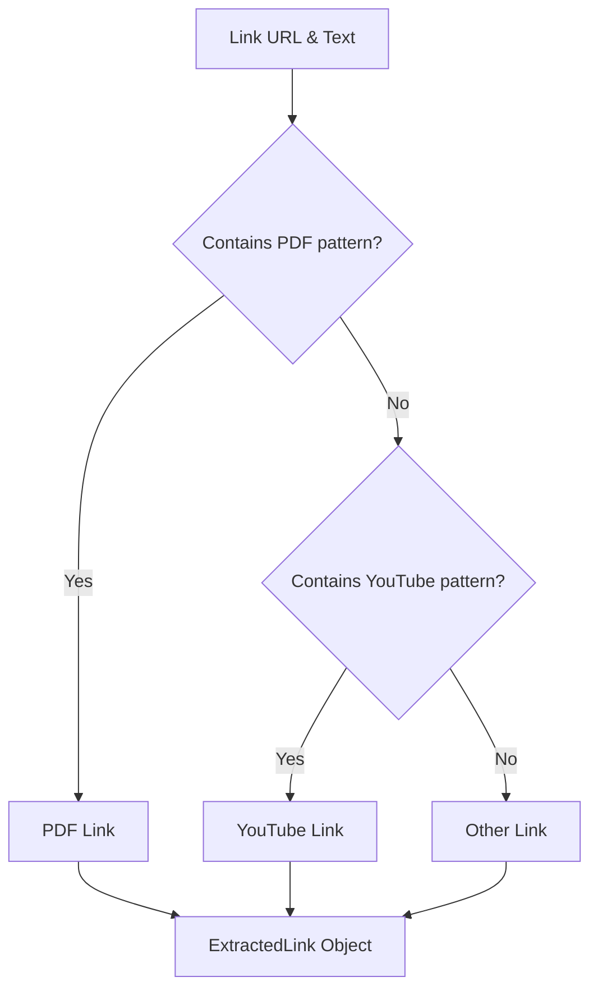

# Web Content Extractor

A professional-grade web content extraction tool that extracts and categorizes links from web pages. Built with modern Python practices, clean architecture, and multiple deployment options.

## Features

- **🔍 Smart Link Extraction**: Extract all links from web pages with intelligent filtering
- **📊 Link Classification**: Automatically categorize links as PDF, YouTube, or other
- **🚀 Multiple Interfaces**: CLI, REST API, and Azure Functions
- **☁️ Cloud Ready**: Deploy to Azure Functions or run locally with Docker
- **📝 Multiple Output Formats**: JSON, Text, Markdown, and CSV
- **🔧 Configurable**: Environment-based configuration with validation
- **📈 Structured Logging**: Production-ready logging with correlation IDs
- **🧪 Comprehensive Testing**: Unit and integration tests with high coverage

## Architecture Overview

The application follows clean architecture principles with clear separation of concerns:



## Workflow Diagram



## Complete Directory Structure

```
web-content-extractor/
├── 📁 src/                          # Source code
│   ├── 📁 core/                     # Domain layer
│   │   ├── __init__.py
│   │   ├── interfaces.py            # Protocol definitions
│   │   ├── models.py                # Pydantic domain models
│   │   ├── service.py               # Core business logic
│   │   └── exceptions.py            # Custom exceptions
│   ├── 📁 infrastructure/           # Infrastructure layer
│   │   ├── __init__.py
│   │   ├── http_client.py           # Async HTTP client
│   │   ├── html_parser.py           # BeautifulSoup parser
│   │   ├── link_classifier.py       # Regex-based classifier
│   │   ├── formatters.py            # Output formatters
│   │   ├── local_storage.py         # Local file storage
│   │   └── cloud_storage.py         # Azure Blob storage
│   ├── 📁 api/                      # FastAPI web server
│   │   ├── __init__.py
│   │   └── app.py                   # FastAPI application
│   ├── 📁 functions/                # Azure Functions
│   │   ├── __init__.py
│   │   ├── extract_http_trigger.py  # HTTP trigger
│   │   └── extract_blob_trigger.py  # Blob trigger
│   ├── cli.py                       # Command-line interface
│   ├── settings.py                  # Configuration management
│   ├── logging.py                   # Logging setup
│   └── __init__.py
├── 📁 tests/                        # Test suite
│   ├── 📁 unit/                     # Unit tests
│   │   ├── test_core_models.py      # Domain model tests
│   │   └── test_infrastructure.py   # Infrastructure tests
│   ├── 📁 integration/              # Integration tests
│   │   └── test_extraction_service.py
│   ├── conftest.py                  # Pytest configuration
│   └── __init__.py
├── 📁 docker/                       # Docker configuration
│   ├── Dockerfile                   # Multi-stage build
│   └── docker-compose.yml           # Local development
├── 📁 azure-functions/              # Azure Functions
│   ├── host.json                    # Function app config
│   ├── 📁 ExtractHttpTrigger/
│   │   └── function.json            # HTTP trigger config
│   └── 📁 ExtractBlobTrigger/
│       └── function.json            # Blob trigger config
├── 📁 docs/                         # Documentation
│   ├── improvement_guide.md
│   ├── learning-roadmap.md
│   └── structure.md
├── 📁 scripts/                      # Utility scripts
│   ├── deploy.sh                    # Deployment script
│   ├── setup.sh                     # Setup script
│   └── verify_setup.py              # Project verification
├── 📁 output/                       # Output directory
├── pyproject.toml                   # Poetry configuration
├── Makefile                         # Development commands
├── README.md                        # This file
├── .gitignore                       # Git ignore rules
└── .pre-commit-config.yaml          # Pre-commit hooks
```

## Quick Start

### Prerequisites

- Python 3.10+
- Poetry (for dependency management)

### Installation

```bash
# Clone the repository
git clone <repository-url>
cd web-content-extractor

# Install dependencies
make setup

# Verify setup
make verify

# Run a quick test
make run
```

### Basic Usage

```bash
# Extract links from a URL
web-extractor extract https://example.com

# Save results to file
web-extractor extract https://example.com --output results.json --save

# Use different output format
web-extractor extract https://example.com --format markdown

# Batch processing
web-extractor batch https://example1.com https://example2.com --output-dir ./results

# Start API server
web-extractor serve --host 0.0.0.0 --port 8000
```

## Configuration

Configuration is handled through environment variables with the `WEB_EXTRACTOR_` prefix:

```bash
# HTTP Settings
WEB_EXTRACTOR_HTTP_TIMEOUT=30.0
WEB_EXTRACTOR_MAX_RETRIES=3
WEB_EXTRACTOR_USER_AGENT="WebExtractor/1.0"

# Logging
WEB_EXTRACTOR_LOG_LEVEL=INFO
WEB_EXTRACTOR_JSON_LOGS=false

# Storage
WEB_EXTRACTOR_OUTPUT_DIRECTORY=./output

# Azure Storage (optional)
WEB_EXTRACTOR_AZURE_STORAGE_CONNECTION_STRING=your_connection_string
WEB_EXTRACTOR_AZURE_STORAGE_CONTAINER=extraction-results
```

## API Usage

### Start the API Server

```bash
web-extractor serve
```

### API Endpoints

- `GET /health` - Health check
- `POST /extract` - Extract links from URL

### Example API Request

```bash
curl -X POST "http://localhost:8000/extract" \
     -H "Content-Type: application/json" \
     -d '{"url": "https://example.com", "save_result": true}'
```

## Docker Deployment

### Local Development

```bash
# Start with Docker Compose (includes Azurite for local Azure Storage)
cd docker
docker-compose up --build

# Access the API
curl http://localhost:8000/health
```

### Production Build

```bash
# Build the image
docker build -f docker/Dockerfile -t web-extractor .

# Run the container
docker run -p 8000:8000 web-extractor
```

## Azure Functions Deployment

### Prerequisites

- Azure CLI installed
- Azure Functions Core Tools
- Azure subscription

### Deploy to Azure

```bash
# Install Azure Functions dependencies
poetry install --with azure

# Deploy to Azure Functions
cd azure-functions
func azure functionapp publish your-function-app-name
```

### Function Triggers

- **HTTP Trigger**: `POST /api/extract` - Extract links from a single URL
- **Blob Trigger**: Processes JSON files containing URLs for batch extraction

## Development Workflow



## Development

### Setup Development Environment

```bash
# Install all dependencies including development tools
poetry install --with dev

# Install pre-commit hooks
pre-commit install

# Run tests
make test

# Format code
make format

# Lint code
make lint

# Verify setup
make verify
```

### Running Tests

```bash
# Run all tests
pytest

# Run with coverage
pytest --cov=src --cov-report=html

# Run specific test categories
pytest tests/unit/
pytest tests/integration/
```

### Code Quality

The project uses several tools to maintain code quality:

- **Black**: Code formatting
- **Ruff**: Fast Python linter
- **MyPy**: Static type checking
- **Pre-commit**: Automated quality checks
- **Pytest**: Testing framework

## Data Flow



## Link Classification Logic



## Project Structure

```
web-content-extractor/
├── src/                  # Source code
├── tests/               # Test suite
├── docker/              # Docker configuration
├── azure-functions/     # Azure Functions
├── docs/                # Documentation
├── scripts/             # Deployment scripts
├── output/              # Output directory
├── pyproject.toml       # Poetry configuration
├── Makefile            # Development commands
└── README.md           # This file
```

## Contributing

1. Fork the repository
2. Create a feature branch
3. Make your changes
4. Add tests for new functionality
5. Ensure all tests pass
6. Submit a pull request

## License

This project is licensed under the MIT License - see the LICENSE file for details.

## Support

For support and questions:

- Create an issue on GitHub
- Check the documentation in the `docs/` directory
- Review the architecture documentation
