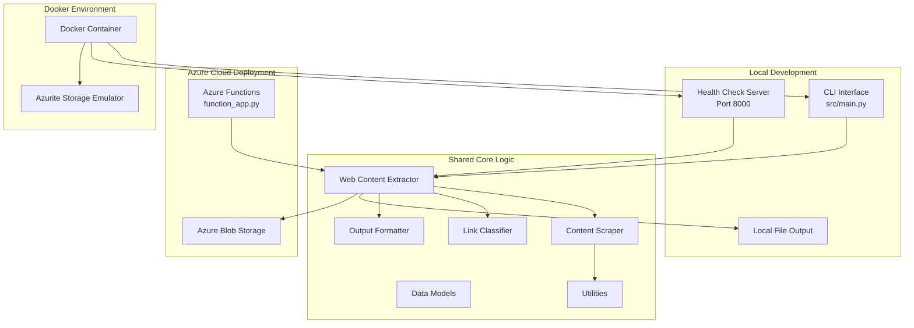

# Web Content Extractor - Architecture

## Enhanced Architecture Diagram

## Enhanced Features

### 1. Shared Core Logic

- **Single Business Logic**: All core extraction functionality is shared between environments
- **Clean Interfaces**: Well-defined services with clear responsibilities
- **Consistent Results**: Same extraction logic used in all deployments

### 2. Multiple Deployment Targets

#### Local CLI

- Standalone command-line tool for direct usage
- File-based output for local analysis
- Built-in health check server for container environments

#### Azure Functions

- Serverless API for cloud-based processing
- Scalable pay-per-use model
- Blob storage integration for result persistence
- Health check endpoint for monitoring

#### Docker Deployment

- Containerized version for consistent environments
- Local Azure storage emulation with Azurite
- Ready for CI/CD pipelines

### 3. Development Workflow

1. **Local Development**: Develop and test using the CLI
2. **Container Testing**: Verify in Docker with simulated cloud services
3. **Cloud Deployment**: Deploy to Azure for production use

### 4. Operational Features

- **Health Checks**: Both local and cloud deployments provide /health endpoints
- **Logging**: Comprehensive logging throughout the application
- **Error Handling**: Detailed error handling with custom exceptions
- **Configuration**: Flexible configuration via YAML, environment variables, and command-line flags
- **Storage Options**: Local file storage or cloud blob storage

This architecture provides maximum flexibility while maintaining a single core codebase, allowing for simplified maintenance and consistent extraction results across all deployment targets.
